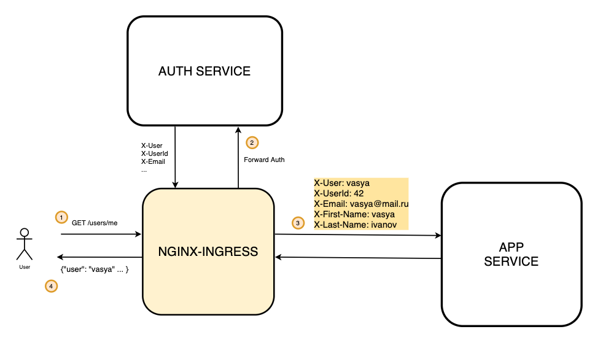

Архитектура решения




В начале убедиться, что nginx ingress запущен

```
minikube addons  enable ingress
minikube tunnel
```

Создаем и делаем дефолтным неймспейс auth
```
kubectl create ns auth
kubectl config set-context --current --namespace=auth
```

Собираем и запускаем с помощью helm сервис аутентификации
```
cd auth
helm install chart2 chart/ --values chart/auth-values.yaml
```

И приложение, в котором мы будем проверять аутентификацию 
```
cd app
helm install chart1 chart/ --values chart/app-values.yaml
```

Применяем манифст для сервиса аутентификации
```
kubectl apply -f auth-ingress.yaml
```

В файле app-ingress.yaml выставлены настройки аутентификации через аннотации.

Auth-url - это урл, который осуществляет проверку на аутентификацию 
Стоит обратить внимание, что урл имеет полное доменное имя внутри кластера (вместе с указанием неймспейса - auth), потому что nginx запущен в другом неймспейсе. 

Также есть указание какие заголовки будут прокидываться в сервис app из сервиса auth.

```yaml
-- cat app-ingress.yaml
apiVersion: networking.k8s.io/v1
kind: Ingress
metadata:
  name: app
  annotations:
    nginx.ingress.kubernetes.io/auth-url: "http://auth.auth.svc.cluster.local:9000/auth"
    nginx.ingress.kubernetes.io/auth-signin: "http://$host/signin"
    nginx.ingress.kubernetes.io/auth-response-headers: "X-User,X-Email,X-UserId,X-First-Name,X-Last-Name"
spec:
  rules:
    - host: arch.homework
      http:
        paths:
          - path: /users/
            pathType: Prefix
            backend:
              service:
                name: app
                port:
                  number: 9000
```

Применяем ингресс для приложения
```
kubectl apply -f app-ingress.yaml
```

После настройки
Запускаем тесты с помощью newman и проверяем, что все корректно запустилось. 


